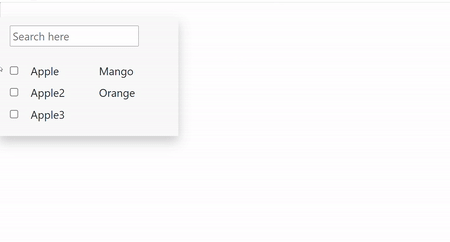

# react-multiselect-search-dropdown

react-multiselect-search-dropdown is a react component which provides you the ability to select multiple values from the list along with a search option.



## Installation

```bash
npm install --save react-multiselect-search-dropdown

```

## Usage

```python
import MultiSelectDropDown from 'react-multiselect-search-dropdown';

    var valuesArr=[
    {'id':1,'options':'Apple','selected':false,'secondaryValue':'Mango'},  //selected:true makes the option checked by default 
    {'id':2,'options':'Apple2','selected':false,'secondaryValue':'Orange'},
    {'id':3,'options':'Apple3','selected':false,'secondaryValue':'Banana'}
     ]                                     //each element should have a unique id,options that will be displayed and 'selected' key

     
     <MultiSelectDropDown
      id="dropdown1"                                            // pass a unique id for each multiselectdropdown
      options={valuesArr}                                       //an array with {id,value to be displayed,'selected':true or false}
      getSelectedValues={this.getValues.bind(this)}/>           //function that will give back all the selected values 
```

##  Inputs to pass and Props

| Input/Props  | Name | Mandatory  | Type  | Description |
|:----------- | :----| :--------  |:----  |:----------  |
|`Input`| `id` | `yes` | `number`  | Unique id to identify each option
|`Input`| `options` | `yes` | `string` | Primary data that gets displayed in dropdown list
|`Input`| `selected` | `yes` | `boolean` | To determine whether an option should be selected by default or not
|`Input`| `secondaryValue` | `no` | `string` | Additional data that gets displayed along with options
|`Props`| `options` | `yes` | `array` | Option list that needs to be passed to  <MultiSelectDropDown/>
|`Props`| `getSelectedValues` | `yes` | `function` | function that will give back all the selected values 
```


## License
[MIT](https://choosealicense.com/licenses/mit/)